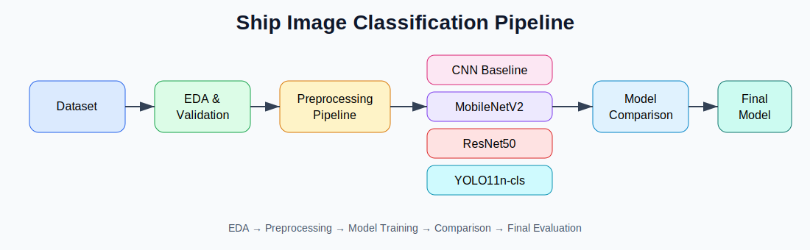
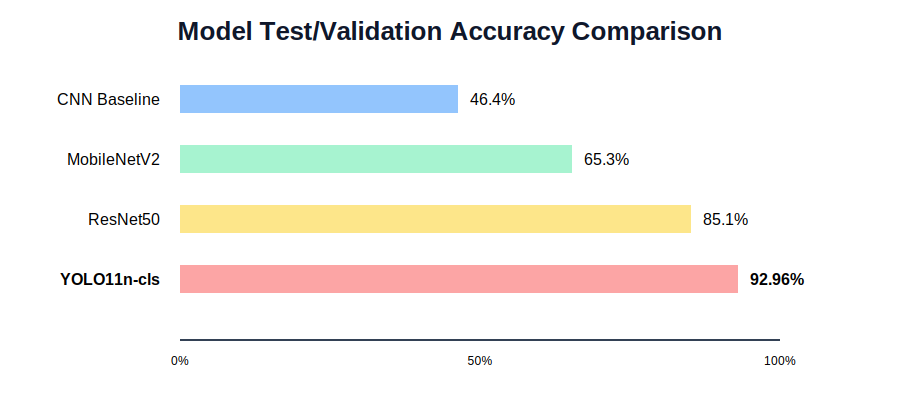
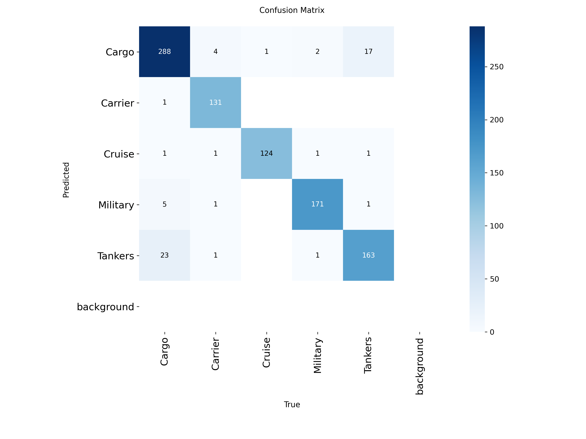
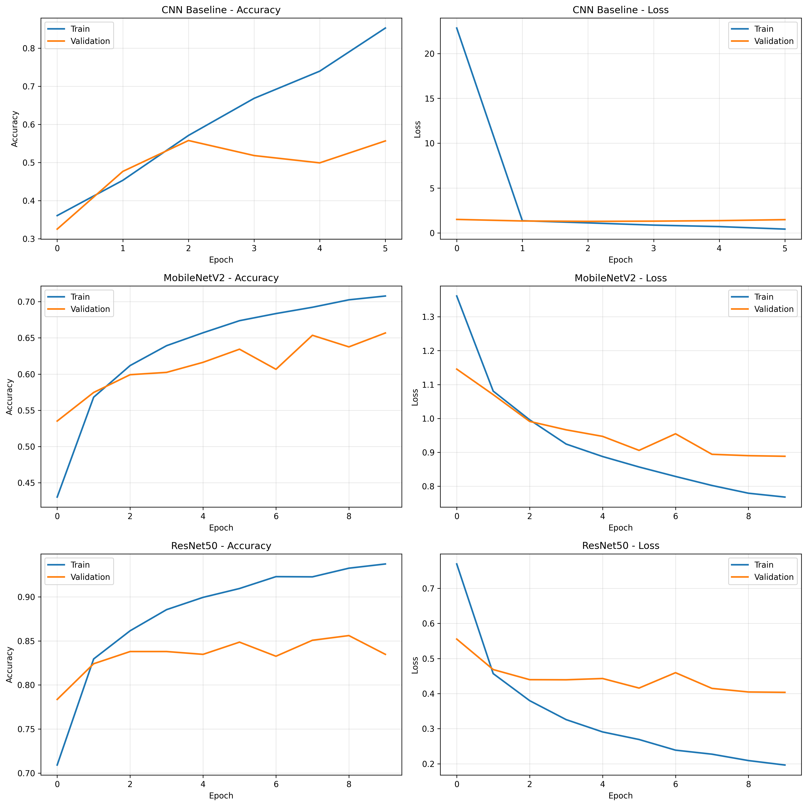

<div align="center">

# 🚢 Ship Image Classification using Deep Learning

### Automatic Ship Classification using CNNs, Transfer Learning and YOLO11 Classification


</div>

---

## 📖 Overview

This repository presents a complete Deep Learning pipeline for automatic ship image classification.

The project compares different neural network architectures, including a CNN baseline, Transfer Learning models and the Ultralytics YOLO11 classification architecture.

The study was developed as a Machine Learning MVP focused on reproducibility, model comparison, experimental evaluation and error analysis.

---

## 🚀 Highlights

- Complete Exploratory Data Analysis (EDA)
- Dataset validation and integrity checking
- Stratified train/validation/test split
- CNN Baseline
- MobileNetV2
- ResNet50
- YOLO11n-cls
- Model comparison
- Hyperparameter and optimization discussion
- Confusion matrix and normalized confusion matrix
- Error analysis
- Artifact saving
- Fully reproducible notebook

---

## 🎯 Problem

Automatic ship classification is relevant for:

- Maritime surveillance
- Coastal monitoring
- Port security
- Maritime situational awareness
- Decision support systems
- Naval and defense applications

The objective of this work is to compare different Deep Learning architectures and identify the model with the best generalization capability for multiclass ship image classification.

---

## 🏗 Project Pipeline



---

## 🤖 Models Evaluated

| Model | Strategy | Description |
|---|---|---|
| CNN Baseline | Built from scratch | Reference model trained only with the available dataset |
| MobileNetV2 | Transfer Learning | Lightweight pretrained architecture |
| ResNet50 | Transfer Learning | Deeper pretrained architecture with residual connections |
| **YOLO11n-cls** | Ultralytics Classification | Modern classification model from the YOLO family |

---

## 📈 Final Results

| Model | Validation Accuracy | Test Accuracy | Notes |
|---|---:|---:|---|
| CNN Baseline | 46.4% | — | Baseline model |
| MobileNetV2 | 65.3% | — | Lightweight Transfer Learning model |
| ResNet50 | 85.1% | — | Best TensorFlow/Keras model |
| 🏆 **YOLO11n-cls** | **95.1%** | **92.96%** | Best overall model |

---

## 🥇 Best Model

The best overall performance was achieved by **YOLO11n-cls**.

| Metric | Value |
|---|---:|
| Test Accuracy / Top-1 Accuracy | 92.96% |
| Top-5 Accuracy | 100.00% |
| Precision Macro | 0.9394 |
| Recall Macro | 0.9371 |
| F1-score Macro | 0.9379 |

---

## 📊 Results

### Model Comparison



### Confusion Matrix

> Replace this file with the confusion matrix generated by the notebook.



### Training Curves

> Replace this file with the training curves generated by the notebook.



---

## 📂 Repository Structure

```text
ship-image-classification/

├── README.md
├── LICENSE
├── requirements.txt
├── .gitignore
│
├── notebook/
│   └── Ship_Classification.ipynb
│
├── figures/
│   ├── pipeline.svg
│   ├── model_comparison.svg
│   ├── confusion_matrix.png
│   └── training_curves.png
│
├── artifacts/
│   ├── best_yolo11n_cls_ship_classification.pt
│   ├── final_metrics.csv
│   └── confusion_matrix_yolo.csv
│
└── dataset_sample/
```

---

## ⚙️ Requirements

Main dependencies:

- Python 3.12
- TensorFlow / Keras
- Ultralytics
- Scikit-Learn
- NumPy
- Pandas
- Matplotlib
- Seaborn
- Pillow
- KaggleHub

Install with:

```bash
pip install -r requirements.txt
```

---

## ▶️ How to Run

Clone the repository:

```bash
git clone https://github.com/YOUR-USERNAME/ship-image-classification.git
cd ship-image-classification
```

Install dependencies:

```bash
pip install -r requirements.txt
```

Open the notebook:

```text
notebook/Ship_Classification.ipynb
```

The notebook can also be executed directly in Google Colab.

---

## 🧪 Methodology

The project follows a complete Machine Learning workflow:

1. Dataset selection
2. Exploratory Data Analysis
3. Dataset integrity checking
4. Stratified train/validation/test split
5. Image preprocessing
6. CNN baseline modeling
7. Transfer Learning with MobileNetV2 and ResNet50
8. YOLO11n-cls training
9. Model comparison
10. Final evaluation on test data
11. Confusion matrix and error analysis
12. Artifact saving

---

## 💡 Main Findings

The experiments indicate that:

- A CNN trained from scratch provides a useful baseline but has limited generalization.
- Transfer Learning substantially improves performance on moderate-sized image datasets.
- ResNet50 was the strongest TensorFlow/Keras architecture in the experiments.
- YOLO11n-cls achieved the best overall performance.
- Most residual errors occurred between visually similar classes, especially Cargo and Tankers.

---

## 🔬 Future Work

Possible future developments include:

- Larger and more diverse maritime image datasets
- Advanced data augmentation strategies
- Systematic hyperparameter optimization
- Fine tuning of YOLO backbones
- Vision Transformers
- Ensemble Learning
- Integration with AIS maritime data
- Multimodal maritime monitoring systems

---

## 👩‍💻 Author

**Ana Paula Santiago de Falco**

Chemical Engineer  
PhD in Polymer Science and Technology  
PhD in Maritime Policy and Strategy  

Rio de Janeiro, Brazil

---

## 🙏 Acknowledgments

This project was developed as part of a Machine Learning and Deep Learning MVP focused on practical applications of Computer Vision to maritime surveillance problems.

---

## 📜 License

This project is released under the MIT License.
